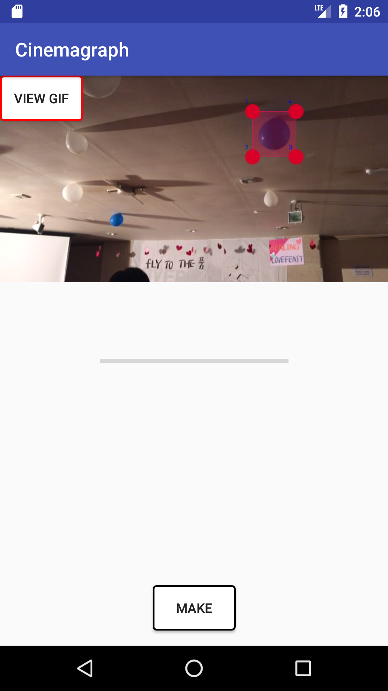

# Cinemagraph
Naver Campus Hackthon에서 진행했던 프로젝트입니다.

## Step 1
10초이내인 비디오 선택
## Step 2
자를 부분 선택 ( 이 부분만 움직임 )

 

## Step 3
Process바가 다 찰 때까지 기다리면 test.gif라는 이름으로 파일이 생성됨

### VIEW GIF
gif 뷰어가 없을 경우, 이 버튼을 눌러서 확인 가능

### Android GIF 인코더 속도 향상 
1. AnimatedGifEncoder 속도를 향상하기 위해 NeuQuant 알고리즘와 LZW 압축 알고리즘을 native 코드로 전환함 (gifflen 사용)
2. NeqQuant에서 컬러 매핑시 캐쉬 사용

 결과 : 8초 Video의 경우
 original version -> 7.086
 modifed version -> 1.541 ~ 0.91
